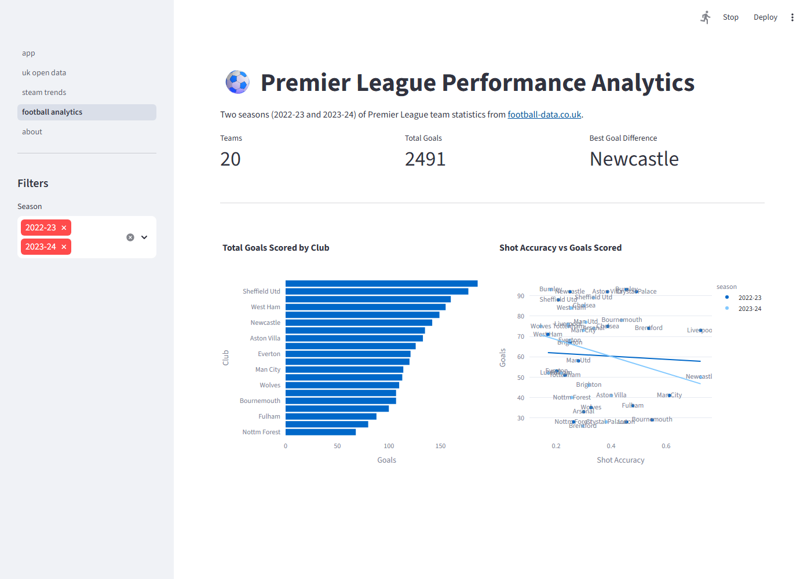
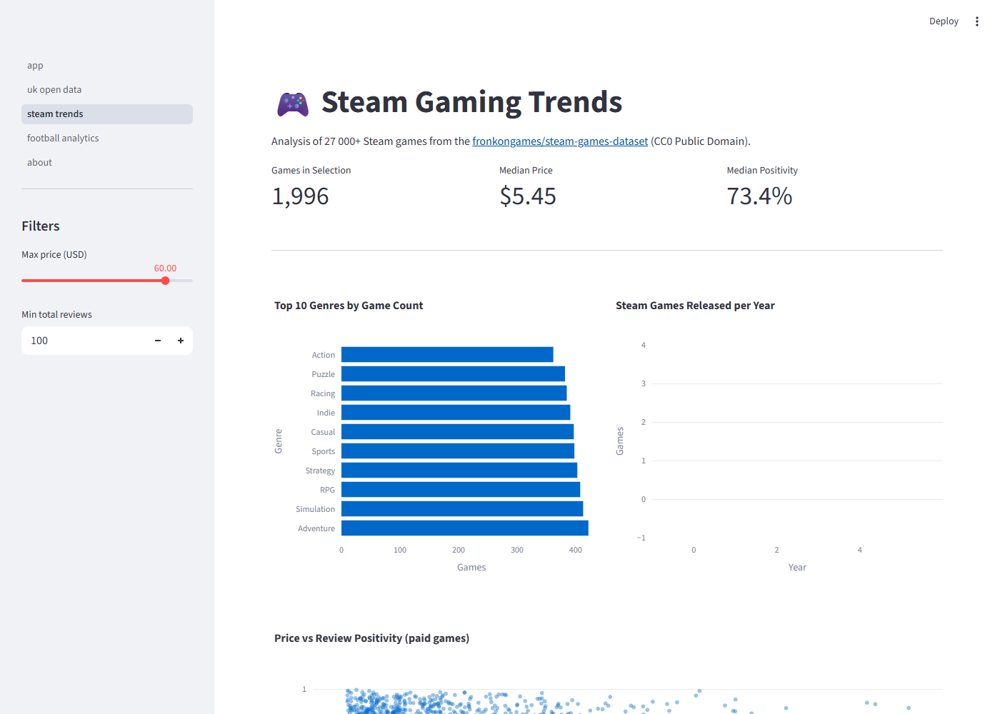
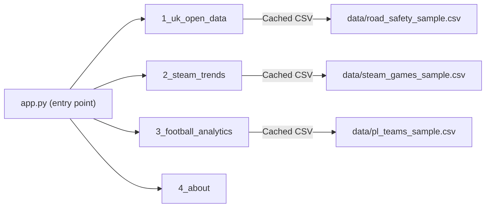

# streamlit-portfolio-dashboard

> **Deploy-ready** for [Streamlit Community Cloud](https://streamlit.io/cloud).
> After deploying, drop the badge URL here:
> `[](https://<your-app>.streamlit.app)`

A multi-page Streamlit dashboard that brings together analytical work from three portfolio projects into a single, navigable application.

## Screenshots

| Football Analytics | Steam Trends |
|---|---|
|  |  |

Regenerate with `streamlit run app.py` then `python docs/capture_screenshots.py`.

## Pages

| Page | Data Source | Description |
|---|---|---|
| 🇬🇧 UK Open Data | Project 04 | Road collision trends, severity, hour-of-day and weather breakdowns |
| 🎮 Steam Gaming Trends | Project 05 | Genre popularity, pricing analysis, release volume over time |
| ⚽ Football Analytics | Project 06 | Premier League team stats, shot accuracy, goal differentials |
| ℹ️ About | — | Data sources, methodology, and portfolio links |

## Wireframe & Navigation

See [docs/wireframe.md](docs/wireframe.md) for the page wireframe (ARTEFACT 10-A) and
the navigation/data-source diagram (ARTEFACT 10-C):



## Quick Start

```bash
pip install -r requirements.txt
streamlit run app.py
```

The app uses bundled sample data in `data/` so it runs without downloading the full datasets from Projects 04–06.

## Architecture

```
streamlit-portfolio-dashboard/
├── app.py                     # Entry point; page config
├── pages/
│   ├── 1_uk_open_data.py      # Road safety analytics page
│   ├── 2_steam_trends.py      # Steam gaming trends page
│   ├── 3_football_analytics.py # Premier League analytics page
│   └── 4_about.py             # About / methodology page
├── src/
│   ├── data_loaders.py        # @st.cache_data loading functions
│   └── chart_builders.py      # Reusable Plotly chart builders
├── data/
│   ├── road_safety_sample.csv # 10k-row STATS19 sample
│   ├── steam_games_sample.csv # 2k-row Steam games sample
│   └── pl_teams_sample.csv    # PL team season stats
└── docs/
    ├── wireframe.md           # App wireframe + nav diagram (10-A, 10-C)
    ├── capture_screenshots.py # Headless page screenshot generator
    └── page_*.png             # Page screenshots
```

## Deployment

1. Push to GitHub
2. Connect repo at [share.streamlit.io](https://share.streamlit.io)
3. Set main file path to `app.py`
4. No secrets required — all data is bundled

## Licence

MIT
