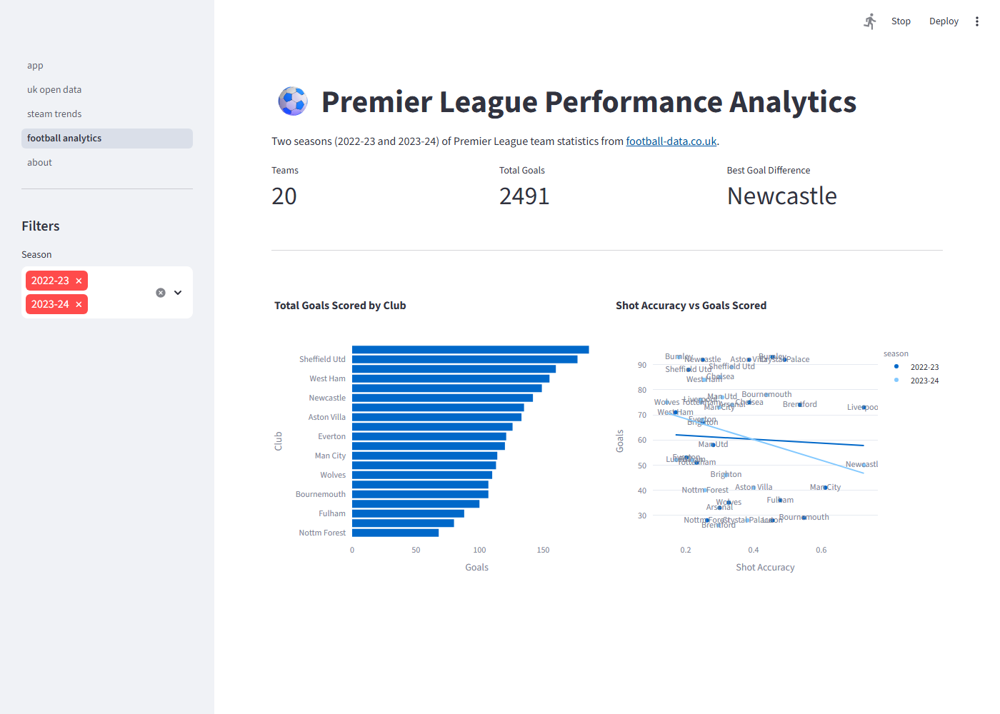
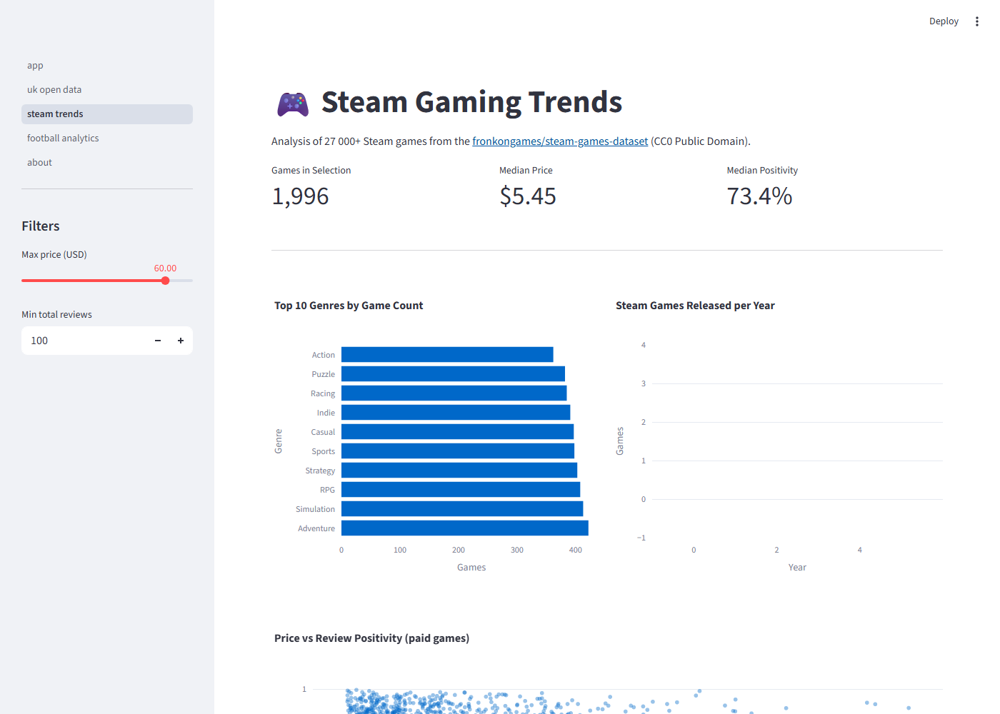

# streamlit-portfolio-dashboard

A multi-page Streamlit app that collects charts from three of my data projects: UK road collisions (STATS19), Steam game genres and prices, and Premier League team stats. An About page lists the data sources and methods.

| Football analytics | Steam trends |
|---|---|
|  |  |

## Run

```bash
pip install -r requirements.txt
streamlit run app.py
```

The app reads synthetic sample CSVs from `data/`, generated by `data/generate_samples.py` with roughly the shape of the real datasets, so it needs no downloads or secrets. To deploy on Streamlit Community Cloud, point it at `app.py`.

The page layout sketch is in `docs/wireframe.md`. Screenshots come from `python docs/capture_screenshots.py` while the app is running.

MIT licence.
