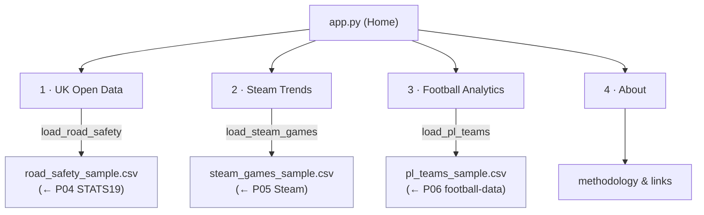

# Dashboard Wireframe (ARTEFACT 10-A)

Low-fidelity layout shared by every page: a persistent left sidebar (navigation +
global/page filters) and a wide main column (title → KPI metric row → chart grid).

```
┌──────────────────────────────────────────────────────────────────────────┐
│ ┌───────────────┐  ┌─────────────────────────────────────────────────────┐ │
│ │  SIDEBAR      │  │  MAIN AREA                                          │ │
│ │               │  │                                                     │ │
│ │ 📊 Portfolio  │  │  🎮  Page Title                                     │ │
│ │  Dashboard    │  │  short description / data source link               │ │
│ │ ───────────── │  │  ─────────────────────────────────────────────────  │ │
│ │  • app (home) │  │  ┌─────────┐ ┌─────────┐ ┌─────────┐                 │ │
│ │  • uk open    │  │  │ KPI 1   │ │ KPI 2   │ │ KPI 3   │   (st.metric)   │ │
│ │  • steam      │  │  └─────────┘ └─────────┘ └─────────┘                 │ │
│ │  • football   │  │  ─────────────────────────────────────────────────  │ │
│ │  • about      │  │  ┌───────────────────┐ ┌───────────────────┐         │ │
│ │ ───────────── │  │  │  Plotly chart A   │ │  Plotly chart B   │         │ │
│ │  Filters      │  │  │  (interactive)    │ │  (interactive)    │         │ │
│ │  [ Season  ▾] │  │  └───────────────────┘ └───────────────────┘         │ │
│ │  [ Metric  ▾] │  │  ┌─────────────────────────────────────────┐         │ │
│ │  [ Date  ──○ ]│  │  │  Plotly chart C / data table            │         │ │
│ │               │  │  └─────────────────────────────────────────┘         │ │
│ │  Source links │  │                                                     │ │
│ └───────────────┘  └─────────────────────────────────────────────────────┘ │
└──────────────────────────────────────────────────────────────────────────┘
```

## Page navigation & data sources (ARTEFACT 10-C)



All loaders are wrapped in `@st.cache_data` so each CSV is read once per session.
